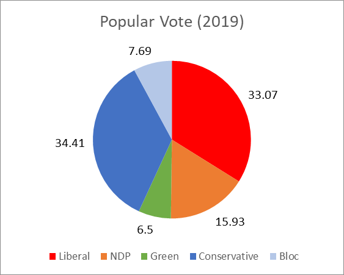
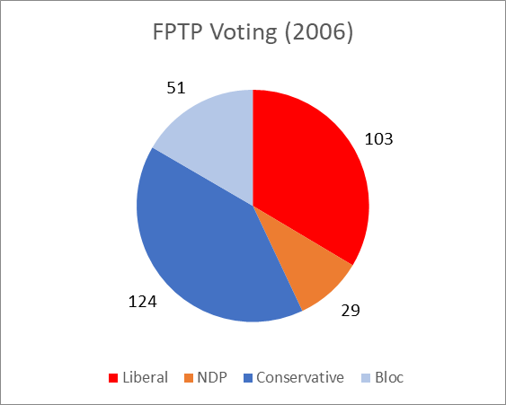

# Canada Ranked Voting Projection - 2004 to 2019
This is a projection of what election results in Canada would look like if a ranked voting system (instant-runoff) was used, as opposed to the current First Past the Post (FPTP) system. I have noticed reports of the projected number of seats in a Proportional Representation (PR) system (e.g., https://ici.radio-canada.ca/info/2019/elections-federales/mode-scrutin-proportionnelle-mixte-compensatoire/index-en.html?sfns=mo), and I wanted to know what the results would look like in a ranked voting system. I am not advocating for one method over another, I am simply investigating how these systems compare.

The number of seats was calculated using election data from Elections Canada (https://elections.ca), making the assumption that NDP, Green Party, and Liberal voters would rank one another higher than the Conservatives, Bloc, or smaller right-wing parties. Likewise the assumption was made that the Conservatives, Bloc, and smaller right-wing party voters would rank one another higher than the left-wing parties. Including the Bloc in this group was a decision made to be biased towards Conservative votes, although predicting how individual Bloc supporters would rank is not possible.

## Results
Over the last 6 elections there would have been 5 Liberal governments (4 majority and 1 minority in 2008) and 1 NDP minority government in 2008. On average the Conservatives took 54 seats (44% of their seats) in the current FPTP system due to split votes between the NDP, Green, and Liberal voters (the combined votes for NDP, Green, and Liberal voters were greater than the number of Conservative/right-wing voters, but the Conservatives took the seat).

<table>
<tr>
<td>
</td>
<td>
</td>
<td>
</td>
</tr>
<tr>
<td>
</td>
<td>
</td>
<td>
</td>
</tr>
<tr>
<td>
</td>
<td>
</td>
<td>
</td>
</tr>
<tr>
<td>
</td>
<td>
</td>
<td>
</td>
</tr>
<tr>
<td>
</td>
<td>
</td>
<td>
</td>
</tr>
<tr>
<td>
</td>
<td>
</td>
<td>
</td>
</tr>

</table>
