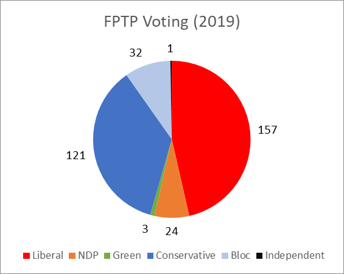

# CanadaRankedVotingProjection
This is a projection of what election results in Canada would look like if a ranked voting system was used. 

<table>
<tr>
<td>

</td>
<td>

</td>
<td>

</td>
</tr>
</table>
